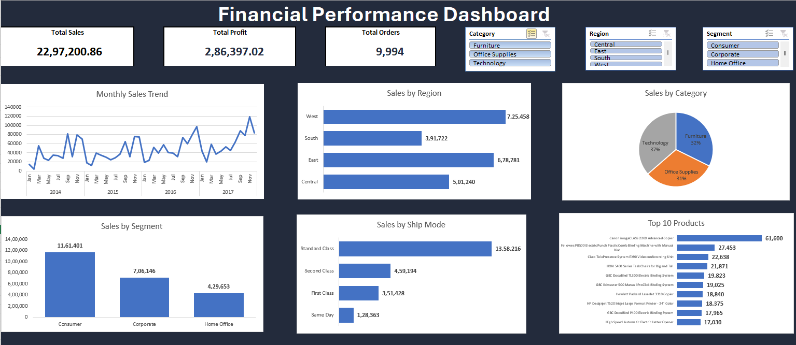

# 📊 Financial Performance Dashboard (Excel)

## 📌 Project Overview

This project is an interactive Financial Performance Dashboard built in Microsoft Excel to analyze sales performance, profit, customer orders, regional performance, product categories, customer segments, shipping modes, and top-selling products.

The dashboard uses Pivot Tables, Pivot Charts, KPI Cards, and Slicers to provide dynamic business insights.

---

## 📷 Dashboard Preview



---

## 🎯 Objectives

- Analyze overall sales performance
- Track total profit and customer orders
- Compare sales across regions
- Analyze sales by category and customer segment
- Monitor shipping mode performance
- Identify Top 10 best-selling products
- Create an interactive dashboard using slicers

---

## 📊 KPI Cards

- 💰 Total Sales
- 💵 Total Profit
- 📦 Total Orders

---

## 📈 Dashboard Visualizations

- Monthly Sales Trend
- Sales by Region
- Sales by Category
- Sales by Segment
- Sales by Ship Mode
- Top 10 Products

---

## 🎛 Interactive Filters

- Region
- Category
- Segment

---

## 🛠 Tools Used

- Microsoft Excel
- Pivot Tables
- Pivot Charts
- Slicers
- Data Visualization
- Dashboard Design

---

## 📂 Dataset

Sample Superstore Dataset

---

## 📁 Project Structure

```
Financial-Performance-Dashboard/
│
├── Dashboard/
│   └── Financial_Performance_Dashboard.xlsx
│
├── Dataset/
│   └── Sample-Superstore.csv
│
├── Screenshot/
│   └── dashboard.png
│
└── README.md
```

---

## 💡 Key Insights

- West region generated the highest sales.
- Technology category contributed the highest revenue.
- Consumer segment generated the highest sales.
- Standard Class was the most preferred shipping mode.
- Canon imageCLASS 2200 Advanced Copier was the top-selling product.

---

## 👨‍💻 Author

**Pratik Shigwan**

Aspiring Data Analyst

Skills:
- Excel
- SQL
- Python
- Power BI
- Data Visualization